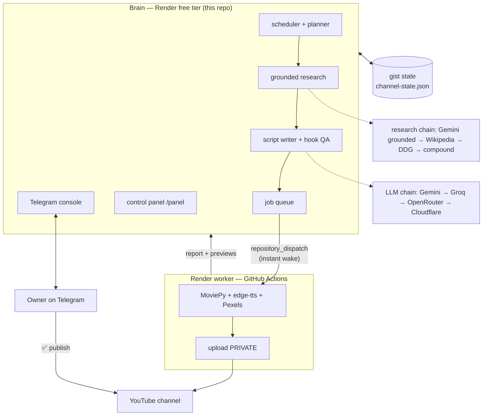

# FOOTNOTE — the channel that runs itself

> Every video is the footnote everyone skipped.

A **zero-cost, fully automated faceless YouTube channel**: research →
script → render → upload → learn, with the owner's ✅ as the only
publishing gate. One person owns it; no step needs a credit card. The
channel makes mystery/history mini-documentaries — Shorts for growth,
long-form for revenue — and every script is written from real, cited
sources.

## How a video gets made

1. **Planning (08:30)** — YouTube Analytics retention data plus a
   strategist pass pick a fresh topic. Never a used one; retention is
   weighted over raw views.
2. **Research** — real sources, chained by reliability: Gemini grounded
   search → Wikipedia API (keyless, datacenter-IP safe) → DuckDuckGo →
   groq/compound. Whichever answers first, the extraction prompt embeds
   the actual search results and every fact must cite one.
3. **Script** — 8–12 scenes, a hook that is scored (retold opening,
   curiosity gap, framing question), title alternatives, per-scene
   Short narrations. Written by the big models only — lite fallback
   models write 3-scene stubs, so script generation is routed past
   them and a 503 falls straight to a full-size model.
4. **Render** — a GitHub Actions runner wakes **within seconds** of the
   job being queued: edge-tts voiceover, Pexels visuals, on-screen
   captions, chapters, a Pollinations thumbnail. One long-form, one
   hook Short, plus standalone scene-Shorts.
5. **Upload, private-first** — every format lands on YouTube as
   **PRIVATE** immediately (a dying runner can never lose a finished
   video), then the Telegram preview arrives with ✅ Publish / ❌
   Discard buttons. No time limit on the decision.
6. **Learn** — per-video retention (longs vs shorts split) feeds the
   next day's planner.

## Architecture



## The ৳0 stack

| Service | Role | Free-tier reality (designed around) |
|---|---|---|
| Render | brain — Flask, one sync worker | spins down when idle; disk is ephemeral |
| GitHub Actions | the render farm | **public repo = unlimited minutes**; ~60–90 min renders |
| GitHub gists | persistent state | survives every restart and deploy overlap |
| Gemini → Groq → OpenRouter → Cloudflare | LLM provider chain | each flaky alone; chained and rotating keys = reliable |
| Wikipedia API | research grounding | keyless, no rate pain, datacenter-safe |
| Pexels / Pollinations | stock visuals / AI thumbnails | free, no card |
| edge-tts | voiceover | free |
| YouTube Data API v3 | uploads + channel management | 10,000 units/day ≈ **6 uploads** (a video is 3) |

## The brain's day (owner's timezone, UTC+6)

| Time | Job |
|---|---|
| 08:00 | daily growth report (views, subs, retention, hook scores) |
| 08:30 | analyze winners/losers → research → write script → queue render |
| 09:00 | queue top-up — only if the pipeline is fully idle |
| 12:00 | underperformer check → title suggestions |
| Sundays 09:00 | weekly strategy summary |
| every 4h | comment sweep → drafted replies await ✅ |

The render worker runs on three cron slots (03:23 / 11:23 / 19:23 UTC)
as a safety net — but normally it never waits for them: **queuing a job
fires a `repository_dispatch` that starts a runner within seconds.**

## Fails open — and shouts when it can't

The design rule: **every dependency is optional, every failure is loud.**

- **LLM chain** — Gemini keys rotate on daily-quota hits (30-min
  cooldown); a 503 falls to Groq's gpt-oss-120b, then OpenRouter, then
  Cloudflare Workers AI. No single provider outage stops generation.
- **Research chain** — if every Gemini key's search grounding is
  quota-hit, the keyless Wikipedia path answers; DDG and compound back
  it up. If *all* sources die, research degrades rather than blocking
  the pipeline.
- **State** — a deploy overlap (draining dyno vs new dyno) used to eat
  jobs and approvals; the gist state now fold-merges by newest stamp,
  with tombstones so deliberate deletions stay deleted.
- **Approval-first uploads** — videos are safely on YouTube (private)
  before the owner is ever asked; a ✅ flips them public, a ❌ deletes.
  A duplicate-upload guard (title + duration bucket) makes re-renders
  safe.
- **Loud failures** — a crashed job, an unknown job, a render whose
  upload failed (dead OAuth token, quota cap) each message the owner
  on Telegram with the cause. `/retry` in the panel requeues failed
  jobs *and* renders that finished but uploaded nothing.

## The control panel

`/panel` is the owner's desk: admin and visitor (read-only) logins,
live queue and worker status, provider health with one-click
diagnostics, retention analytics per video with unlock guidance, a
script viewer, CSV export, and a chat box that answers with channel
context. Passwords live only in Render env vars — never in this repo.

## Repo layout

```
app.py            Flask app: panel, Telegram webhook, worker API, scheduler
brain.py          planning, research, script writing, reports
llm.py            provider chain + keyless search (wiki/ddg) + diagnostics
yt.py             YouTube API for the brain (stats, titles, comments)
yt_analytics.py   YouTube Analytics v2 — the learning loop's eyes
jobs.py           job queue (claim/complete, cost budgeting)
state.py          gist-backed state with deploy-overlap merge rules
comms.py          Telegram console (reports, buttons, alerts)
cloud.py          repository_dispatch — instant render-worker wakeups
worker/           the render farm half (runs on GitHub Actions)
selftest_*.py     7 offline test suites — no keys, no network
```

## Deploy the brain (Render)

1. Push this repo to GitHub (keep it **public** — that's what makes the
   render farm's Actions minutes unlimited).
2. Render → New → Web Service → connect the repo. `render.yaml`
   pre-fills everything; the plan must be **Free**.
3. Environment variables:

| Variable | Required | What it is |
|---|---|---|
| `TELEGRAM_BOT_TOKEN` | ✅ | from @BotFather |
| `OWNER_CHAT_ID` | ✅ | the only chat the bot obeys |
| `WORKER_SECRET` | ✅ | long random string — shared with the worker |
| `GEMINI_API_KEY` | ✅ | free key(s) from aistudio.google.com — comma-separate several, or add `GEMINI_API_KEY_2/_3/_4`; they rotate on quota hits |
| `YT_REFRESH_TOKEN` / `YT_CLIENT_ID` / `YT_CLIENT_SECRET` | ✅ | from the PC-side `extract_refresh_token.py` (one consent covers upload + manage + analytics) |
| `GIST_TOKEN` | ✅ | GitHub token with gist permission — persistent state |
| `GITHUB_DISPATCH_TOKEN` | ✅ | PAT with repo access — fires instant worker wakeups |
| `PANEL_ADMIN_PASSWORD` / `PANEL_VISITOR_PASSWORD` | ✅ | panel logins (public repo — never commit these) |
| `GROQ_API_KEY` | ➖ | free fallback LLM (console.groq.com) |
| `OPENROUTER_API_KEY` | ➖ | second fallback LLM |
| `CF_API_TOKEN` + `CF_ACCOUNT_ID` | ➖ | Cloudflare Workers AI — last safety net |
| `CHANNEL_NAME` | ➖ | display name for reports |

4. After deploy, the bot messages its owner — reply `/status` to confirm.

## The render worker (GitHub Actions)

`.github/workflows/render-worker.yml` runs `worker/worker.py` on an
`ubuntu-latest` runner (6h ceiling, ~40–90 min per video). It needs
these **repo secrets**:

| Secret | What it is |
|---|---|
| `AGENT_URL` | the brain's URL |
| `WORKER_SECRET` | same string as the brain's |
| `BOT_TOKEN` / `CHAT_ID` | Telegram preview sends |
| `YT_TOKEN` | full contents of `token.json` (the worker's OAuth) |
| `YT_CLIENT_SECRET` | contents of `client_secret.json` |
| `PEXELS_API_KEY` | stock visuals |
| `POLLINATIONS_TOKEN` | optional — 3× thumbnail rate |

**Google OAuth note:** if the Google Cloud OAuth consent screen is in
*Testing* mode, refresh tokens expire after **7 days** — publish the
app to production (unverified is fine for personal use) or re-consent
weekly. The worker fails loudly (`invalid_grant` alert) rather than
silently.

## Selftests

Everything critical has an offline test suite — no keys, no network:

```
python selftest_comms.py      # Telegram text handling
python selftest_jobs.py       # the job-merge rules (deploy overlaps)
python selftest_panel_login.py    # panel auth walls
python selftest_panel_extras.py   # desk surfaces + failure alerts
python selftest_analytics.py  # the analytics loop, faked end to end
python selftest_script.py     # script writing + big-model routing
python selftest_llm.py        # provider chain + keyless search parsers
```

Plus `worker/selftest_shots.py` and `worker/selftest_xshorts.py` for
the render side. Run them before every push; they take seconds.

## Known limits (honest ones)

- ~**6 uploads/day** (YouTube quota; a video is 3) — one new video plus
  retries per quota day is the practical ceiling.
- One render at a time per runner; a big backlog takes hours.
- GitHub cron slots can run hours late under load — harmless, because
  queueing wakes a runner instantly.
- Free LLM tiers are flaky at peak hours; the chain absorbs it, and
  script quality is protected by pinning generation to big models.

## No fake growth

No sub4sub, no comment spam, no view automation — nothing in this
codebase fakes a signal. Channels grow from good topics, good titles,
and consistent posting; everything here just removes the toil between
a good idea and a published video.
